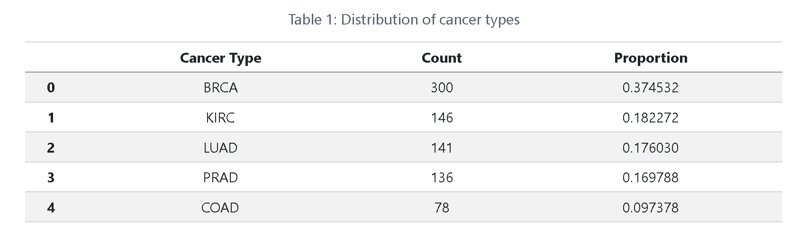

## 🧬 Cancer Classification Model Using Gene Expression Data**

## 📌 Overview**
In this project, I will explore whether gene expression data can be used to help detect cancer by building a machine learning model. My goal is to build a simple proof of concept model that uses gene expression data collected from next-generation sequencing to predict whether cancer is present. The dataset contains expression levels for many genes along with a cancer label indicating whether cancer is present. I use this data to train and develop a classification model that estimates cancer risk from genetic patterns. My goal in this report is not to create a finished medical tool but to assess whether gene expression data contains enough signal to support early cancer detection and justify further development.

**Methods**
- Performed exploratory data analysis on the gene expression data
- Split the data into stratified training and test sets
- Used median imputation to handle missing values
- Built a gradient boosted tree classification model using scikit-learn
- Used GridSearchCV with 5-fold cross-validation for hyperparameter tuning
- Evaluated the final model using test accuracy and a confusion matrix

## 🗂 Project Structure
```text
├── data/                                  # data source and information
├── README.md                              # this file
├── cancer-classification.ipynb            # analysis and machine learning workflow
├── index.html                             # rendered notebook (open in browser)
```

## 📊 Dataset
In this project, I use a gene expression dataset collected from next-generation sequencing experiments. Each observation represents a single biological sample and the features correspond to measured gene expression levels such as “gene_####”. The target variable “cancer” indicates whether the sample is associated with cancer. This dataset allows me to study how patterns in gene expression differ between cancer and non-cancer samples. To support unbiased model evaluation, I split the data into training and test sets while making sure the class proportions stay the same in both.

The goal of my analysis is to use these gene expression profiles to predict whether a biological sample is associated with cancer so understanding the available variables is important. A full description of the features used in this model is provided in the data dictionary below.

**Data Dictionary:**
Target variable (object):
 - cancer: the clinically determined cancer type associated with the tissue sample, possible values include:
 - BRCA: Breast Invasive Carcinoma
 - PRAD: Prostate Adenocarcinoma
 - KIRC: Kidney Renal Clear Cell Carcinoma
 - LUAD: Lung Adenocarcinoma
 - COAD: Colon Adenocarcinoma
Features (float64):
 - gene_####: continuous gene expression measurement for gene number #### in the dataset. These values represent quantified  -  - expression levels obtained using an Illumina HiSeq next-generation sequencing platform.

The dataset is provided through the CS 307 course lab and is not included in this repository due to file size.
Dataset source:
https://lab.cs307.org/genetics/data/genetics.parquet

## 🛠️ Tools
- Python
- pandas
- scikit-learn

## 📊 Exploratory Data Analysis

The distribution of cancer types was examined to understand class balance before building the classification model.



## 🔬 Modeling
To develop a proof of concept cancer classification model, I used a Histogram Gradient Boosting Classifier which works well with gene expression data with a very large number of features and can model complex, non-linear relationships between genes and cancer outcomes. This model was chosen because it performs efficiently on large datasets and does not require feature scaling.

Before modeling, missing gene expression values were handled using median imputation strategy which is a simple and reliable way to handle missing data without being affected by extreme values. I then combined the imputer and the classifier into one scikit-learn pipeline so that the same preprocessing steps were applied consistently during both training and testing.

After that, to improve performance, I tuned some key hyperparameters using GridSearchCV with 5-fold cross-validation. Specifically, I tuned the learning rate, the maximum depth of the trees and the number of boosting iterations. These paramters control how fast the model learns, how complex each tree is and how large the overall model becomes.

During tuning, I measure performance using accuracy metrics since the main goal of building this model is to correctly classify whether cancer is present. The best-performing model was selected and refit on the training dataset.

## 📈 Results

**Test Accuracy: 0.9850746268656716**
The dataset was split into training and test sets using a stratified split so the class distribution stayed the same giving a fair estimate of how well the model works on new data. After tuning the model using GridSearchCV with cross-validation, I evaluated the final selected model on the test dataset. The model achieved a test accuracy of approximately 0.985 meaning it correctly classifies cancer types for about 98.5% of the samples.

Accuracy was an appropriate evaluation metric for this model because the goal of the model is to correctly classify whether a sample is associated with cancer. Because the outcome is a categorical label and the main goal is correct classification, accuracy is a clear and easy to understand measure of performance. It shows how often the model makes the right prediction on unseen data which fits well with measuring the model as a proof of concept cancer detection tool.

## 📚 References
* **Raw data:** CS 307 Genetics Lab — University of Illinois Urbana-Champaign.
  https://lab.cs307.org/genetics/data/genetics.parquet
* **Machine learning:** scikit-learn documentation for `HistGradientBoostingClassifier`, `SimpleImputer`, and `GridSearchCV`.
* **Original data source:** The Cancer Genome Atlas (TCGA) Pan-Cancer Analysis Project; modified for the CS 307 Genetics Lab.


